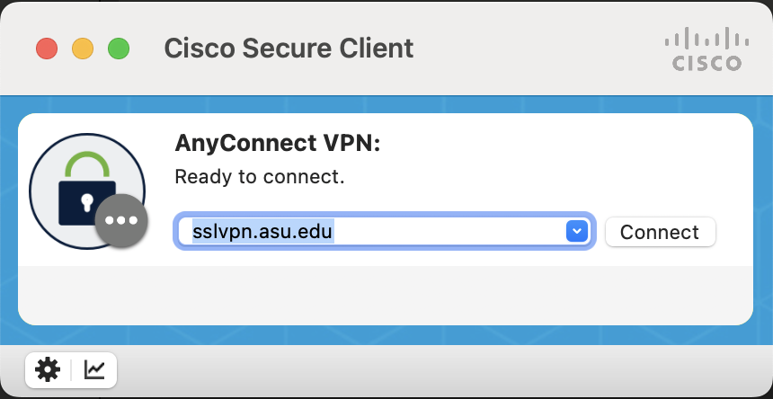

# Guide for VPN and connecting to ASU SOL computing cluster

## Using VPN to connect to ASU network:

Run `Cisco Secure Client` VPN software

type `sslvpn.asu.adu`



Click `Connect`

( if it is not working follow the guide here: https://kb.mit.edu/confluence/display/mitcontrib/Cisco+Anyconnect+Manual+uninstall+Mac+OS )

when asked for username/pass use:

```
username: asuid
pass: asupass
second pass: push 
```

## Login to sol cluster

on your terminal window:

sol:

```
ssh ikazan@login.sol.rc.asu.edu
```

(change asuid to yours)
